# Doubly Linked List Operations

Program to perform all Operations on a Doubly Linked List 
Developed by: Ghanshyam Prajapati. 
Date: 06/12/2020. 

# OutPut: 
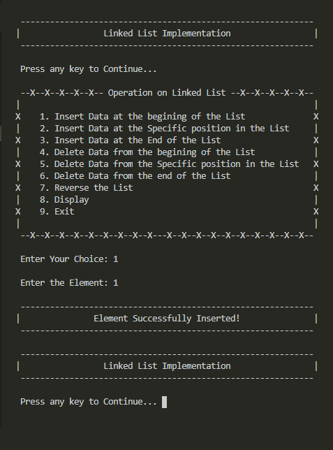  
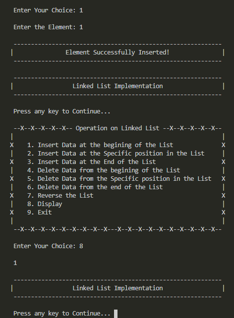  
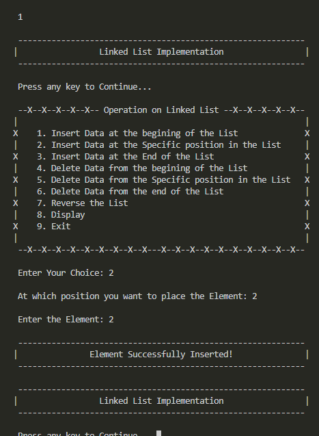  
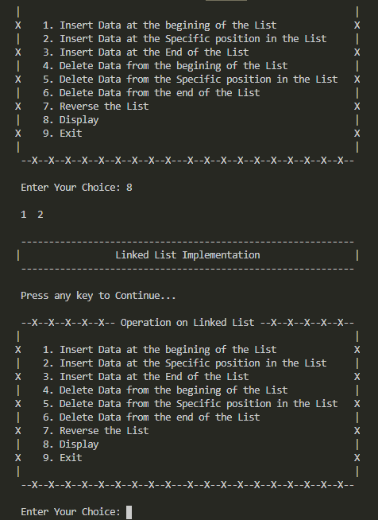  
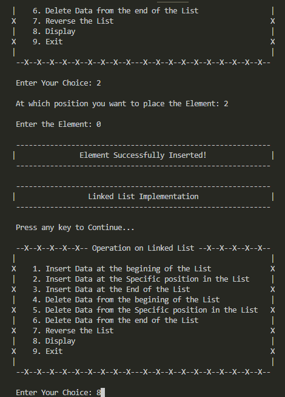  
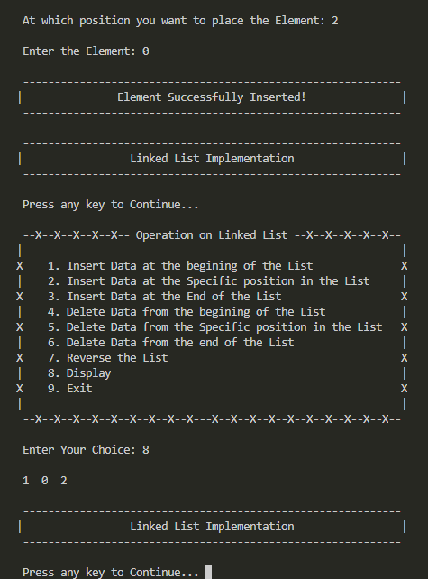  
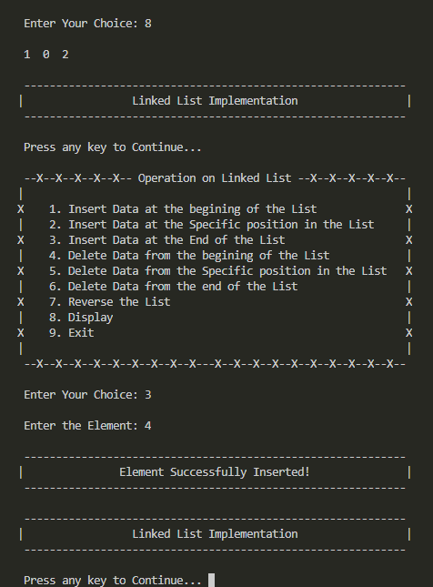  
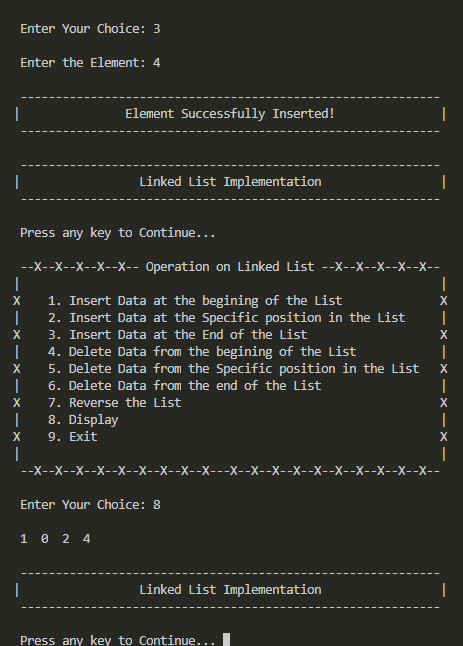  
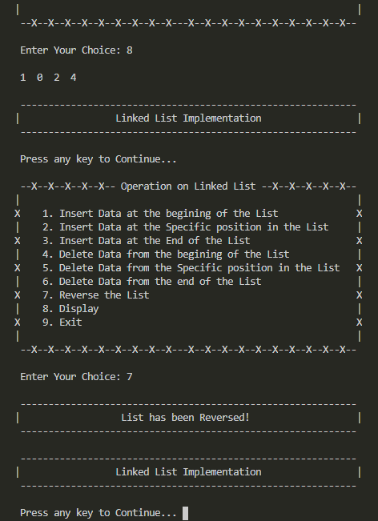  
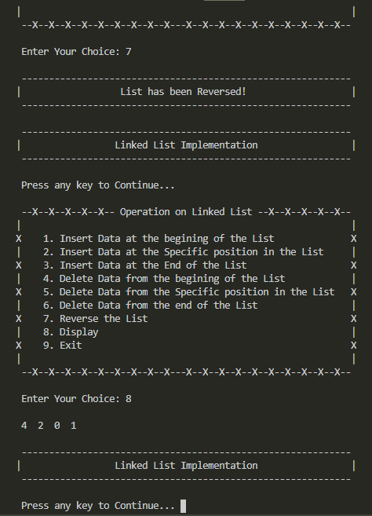  
  
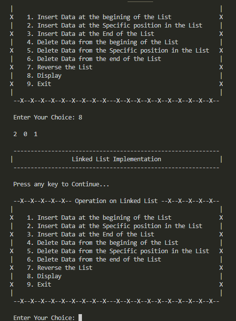  
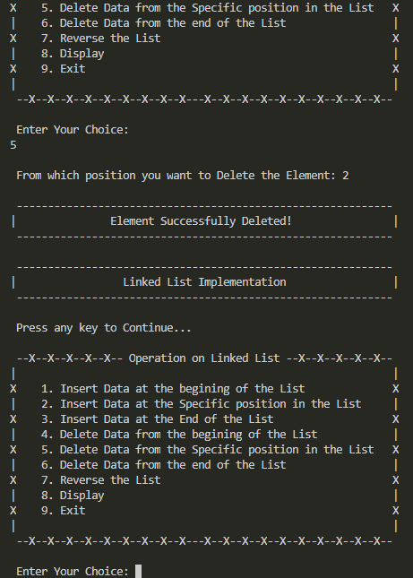  
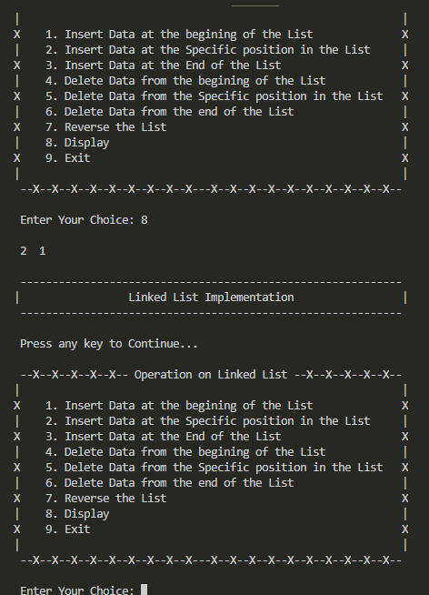  
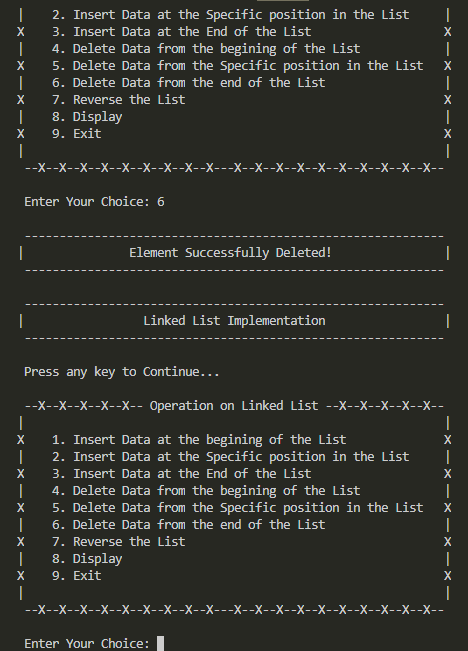  
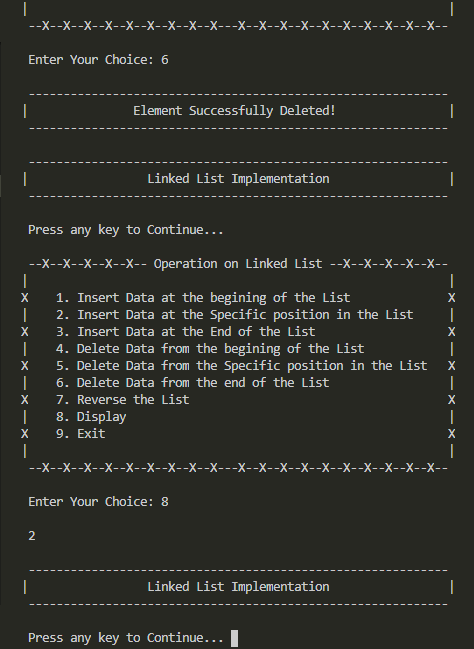  
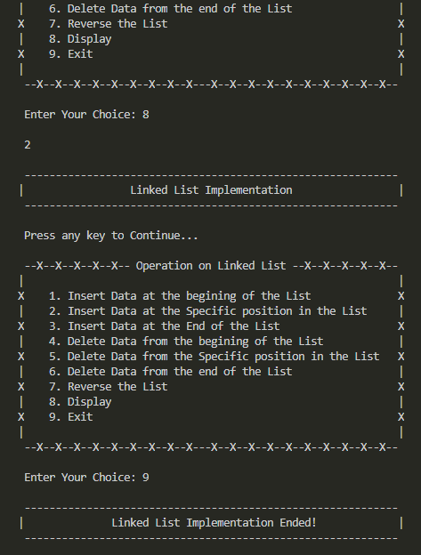  
