# Linked List all Operations

Lab-17: WAP to perform all Operations on a Linked List
Developed by: Ghanshyam Prajapati.
Date: 01/12/2020.

# OutPut: 

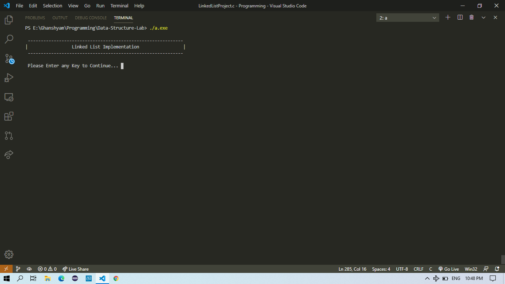  
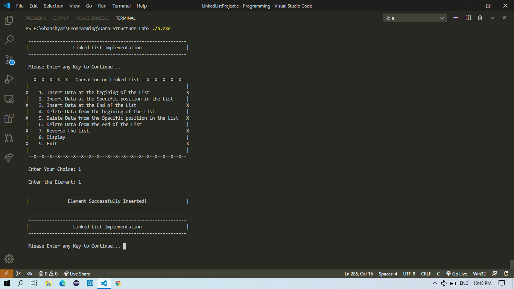  
  
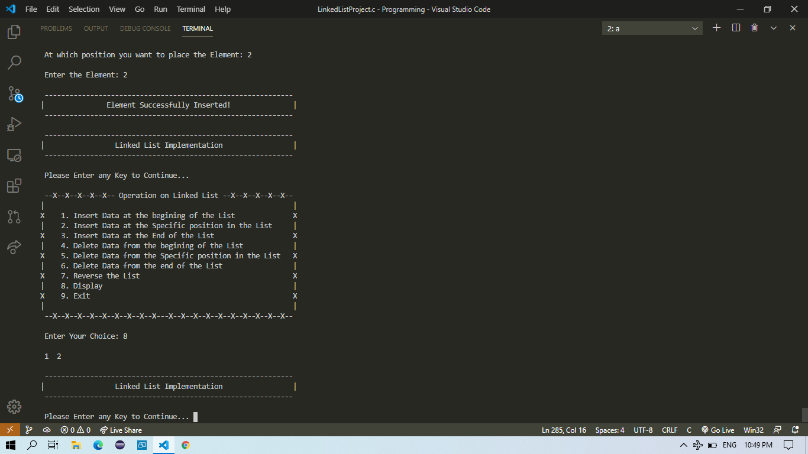  
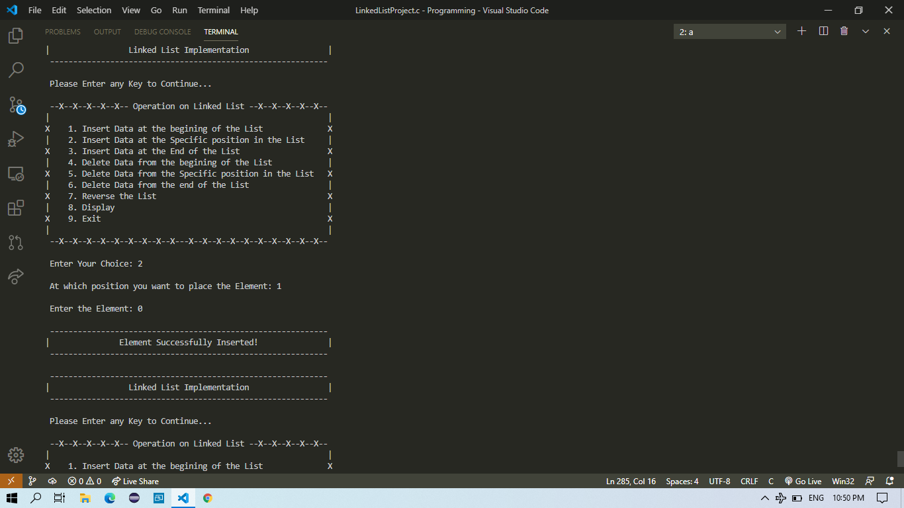  
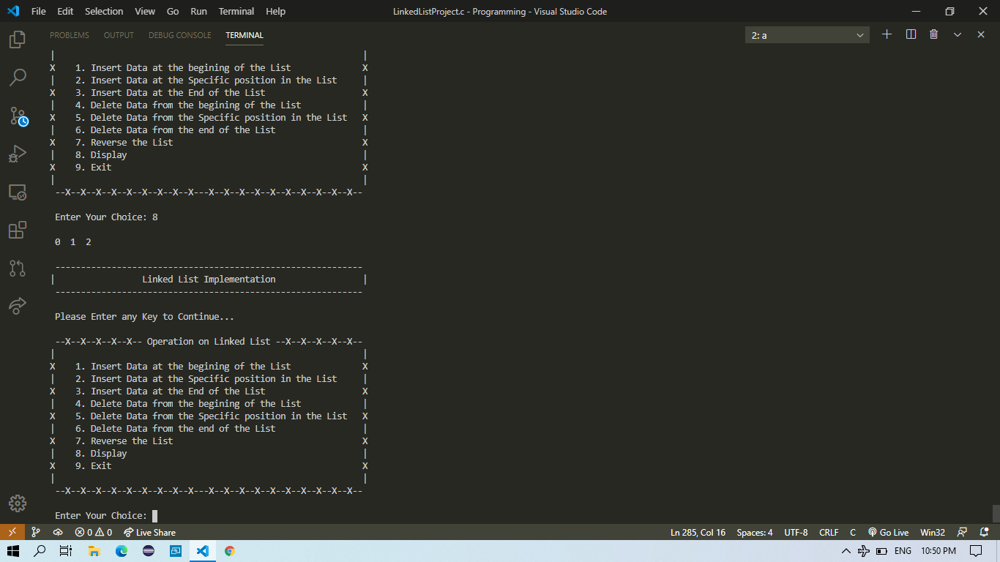  
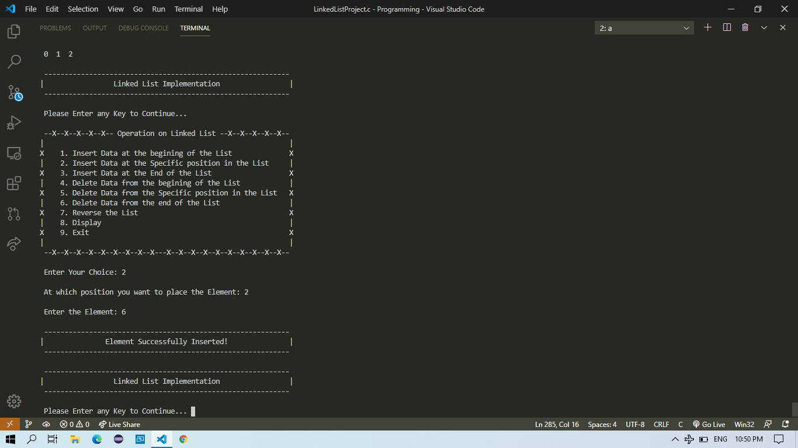  
  
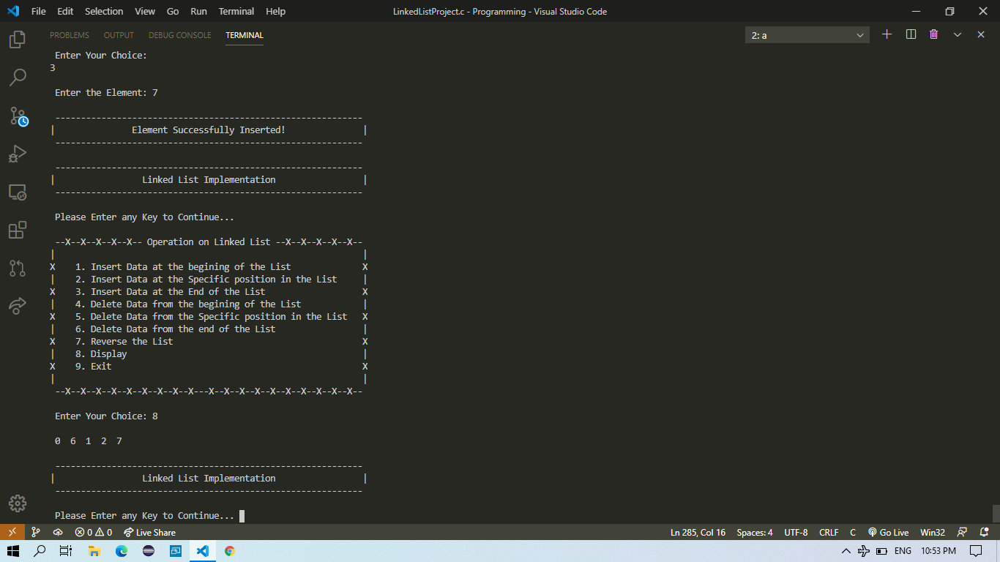  
  
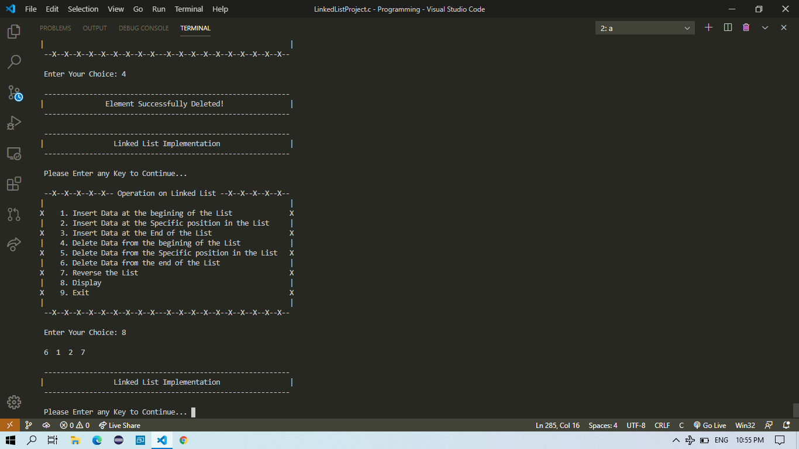  
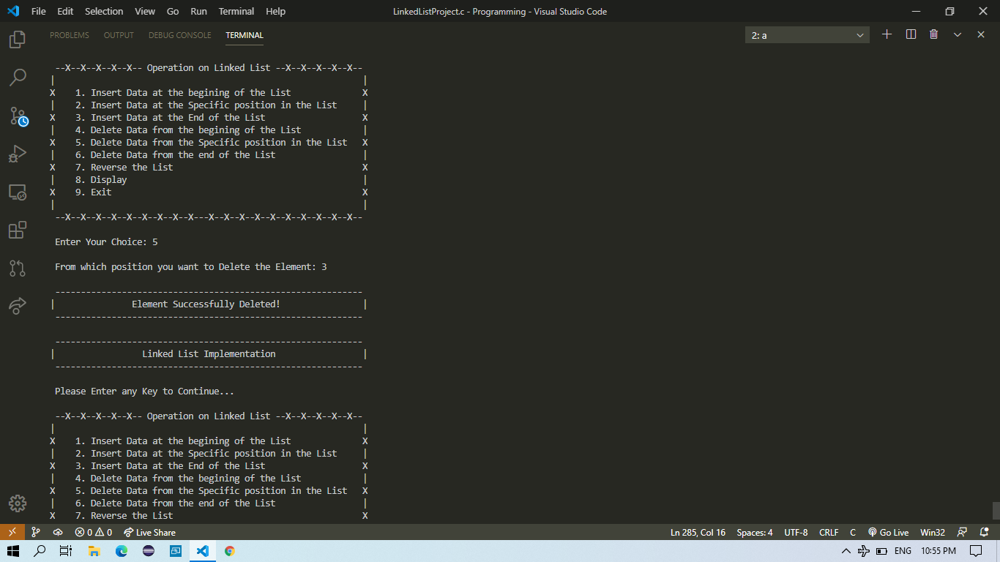  
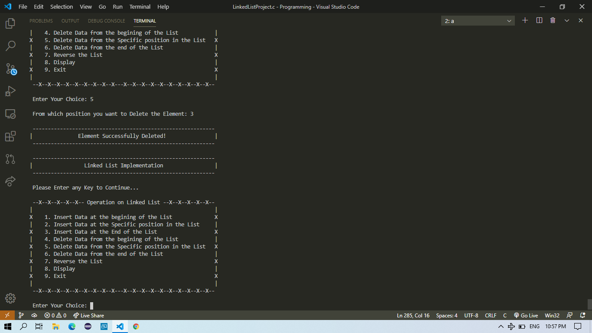  
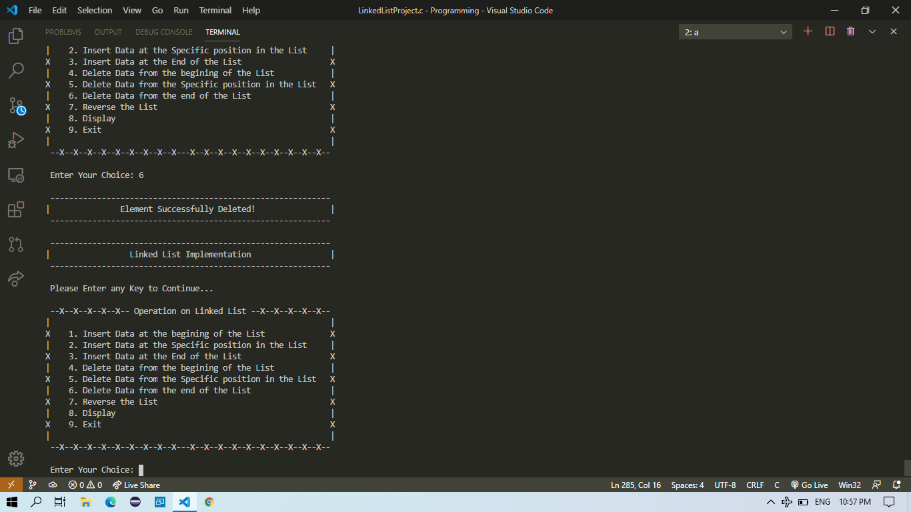  
  
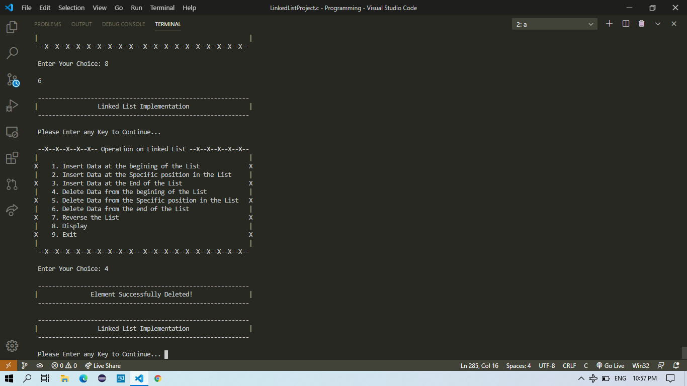  
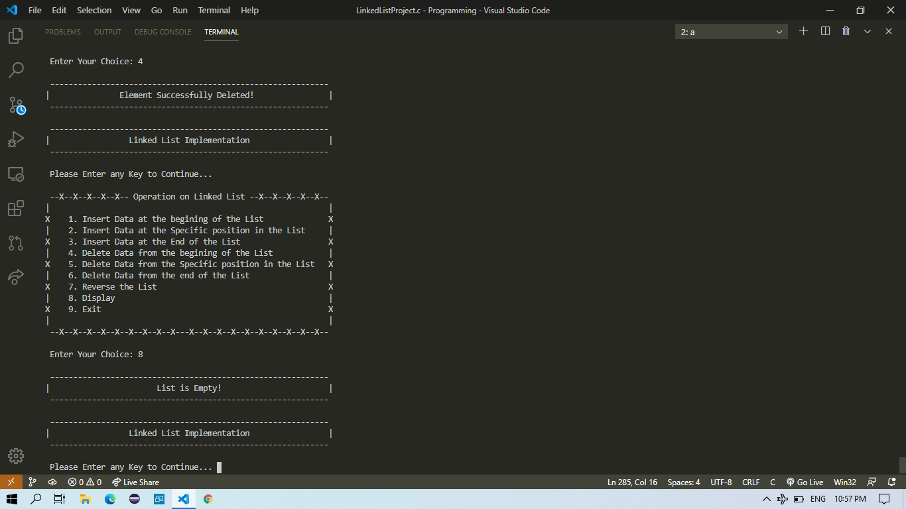  
  
  
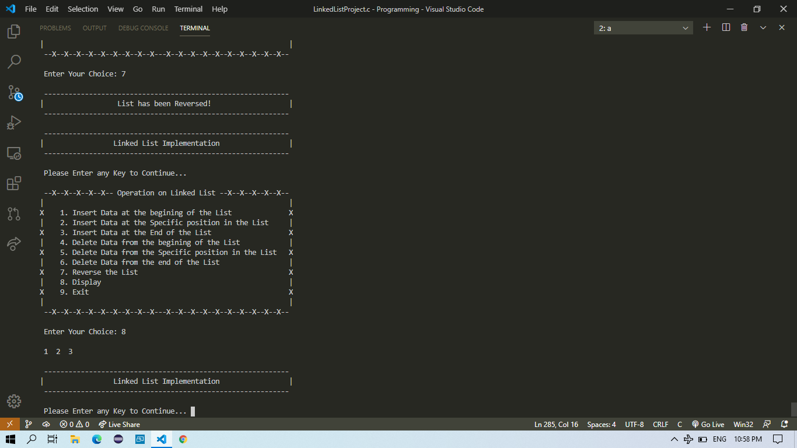  
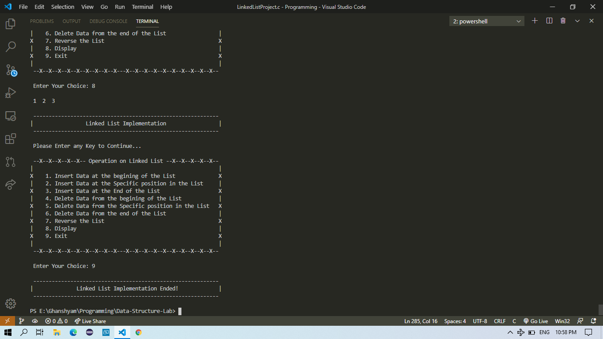  
